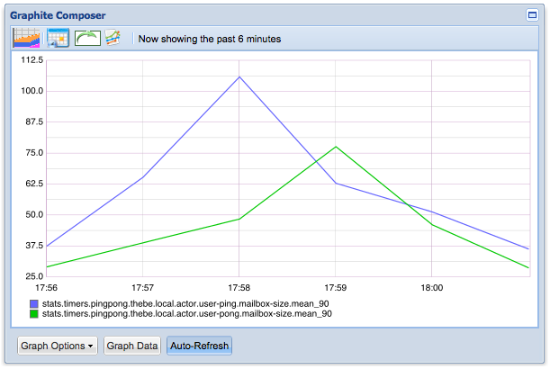
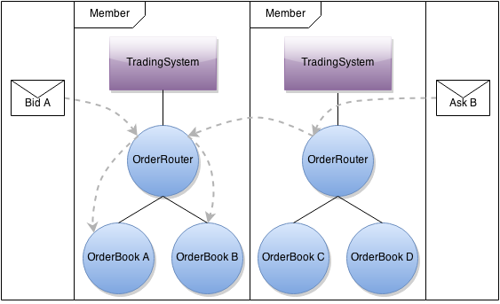
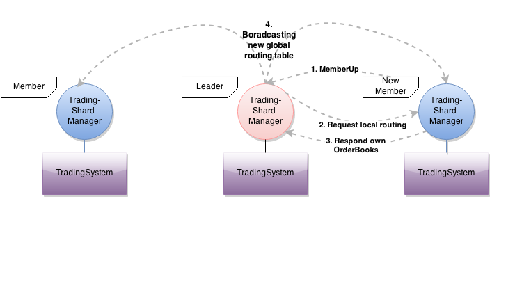

```
██████████╗  █████████╗     █████╗██╗  ████╗  ██╗█████╗     ██╗     █████╗██████╗
╚══██╔══██║  ████╔════╝    ██╔══████║ ██╔██║ ██╔██╔══██╗    ██║    ██╔══████╔══██╗
   ██║  ████████████╗      ████████████╔╝█████╔╝███████║    ██║    █████████████╔╝
   ██║  ██╔══████╔══╝      ██╔══████╔═██╗██╔═██╗██╔══██║    ██║    ██╔══████╔══██╗
   ██║  ██║  █████████╗    ██║  ████║  ████║  ████║  ██║    █████████║  ████████╔╝
   ╚═╝  ╚═╝  ╚═╚══════╝    ╚═╝  ╚═╚═╝  ╚═╚═╝  ╚═╚═╝  ╚═╝    ╚══════╚═╝  ╚═╚═════╝
```

# Reactive Programming with Akka and Scala
## High performance scalable Applications

After getting acquainted with Akka in [our first Akka lab](http://blog.comsysto.com/2014/05/09/reactive-programming-with-akka-and-scala/), we - [@RoadRunner12048](https://twitter.com/RoadRunner12048) and [@dmitterd](https://twitter.com/dmitterd) - wanted to try monitoring an Akka application to get a better understanding of its dynamic behavior. Additionally, we wanted to play with clustering support. We used a very rough Stock trading simulation and a Ping-Pong application that we've both implemented in the first lab as subject for our experiments.

## Upgrading from Akka 2.2.3 to 2.3.2

We started our lab by upgrading to the latest Akka version 2.3.2 and got some compile errors regards routing. So we went through the [migration guide](http://doc.akka.io/docs/akka/2.3.2/project/migration-guide-2.2.x-2.3.x.html) and found the following comment which seemed to apply to us:

<blockquote>The API for creating custom routers and resizers have changed without keeping the old API as deprecated. That should be a an API used by only a few users and they should be able to migrate to the new API without much trouble.</blockquote>

The Akka team has introduced two different types of routers in Akka 2.3: `Pool` and `Group`. Pools are routers that manage their routees by themselves (creation and termination as child actors) whereas Groups are routers that get preconfigured routees from outside.

In our trading application we use a custom router to manage so-called order books. In this scenario the `Pool` approach is better suited because the router has to setup and manage all the `OrderBook` actors by itself. In addition, our router later needs to be configurable at runtime and so we end up with a dedicated actor which uses an embedded router as described in the [Akka documentation](http://doc.akka.io/docs/akka/2.3.2/scala/routing.html#A_Router_Actor). So our router actor can forward messages to its `OrderBook`s but handle routing configuration messages by itself if necessary:

```
// Actor with routing functionality
class OrderRoutingActor(securities: Seq[Security]) extends Actor with ActorLogging {

  // routes all Asks and Bids belonging to same Security to a single OrderBook
  val routingLogic = new OrderBookRoutingLogic()
  
  // the router
  val router = new Router(routingLogic)

  override def preStart(): Unit = {

    // setup child OrderBook actor for given security   
    securities.foreach { security =>

      val orderBookForSecurity = context.actorOf(Props[OrderBook](
          new OrderBook(security) with SimpleTradeMatcher with AverageMarketPriceCalculator), security.name)

      routingLogic.addOrderBook(security, orderBookForSecurity)
    }

    log.info(s"Orderbook router for $securities is started.")
  }
  
  override def receive: Receive = {

    // handle new router configuration
    case UpdateConfig(config) => // reconfigure routingLogic
    
    // route the rest
    case msg => router.route(msg, sender())
  }
}
```

Lets describe step by step what the router does. As already mentioned, we created a dedicated actor to route messages using a `Router`. Internally the `Router` uses the `OrderBookRoutingLogic` which simply holds a `Map` of `Security` to `ActorRef`. Each message of type `Order`, which are `Bid`s or `Ask`s on a `Security`, will be routed to the responsible `OrderBook`. All other messages will be broadcasted to all known `ActorRef`s.

This is nearly the same as before the upgrade to Akka 2.3.2, but the router wasn't an `Actor` which makes quite a difference. Normally, message are added synchronously to an `Actor`'s mailbox and routing is done in the very same step. However, when the `Router` itself is embedded into an `Actor` each message will be first added to the routing actor's mailbox (synchronously). When the router processes the message it adds it to destination Actor's mailbox. As two consecutive mailboxes are involved instead of only one this will increase message latency. Although in a real world trading app nanoseconds can matter we will not bother further in our demo application.

## Monitoring Akka

We wanted to find out more about the runtime behavior of our Akka system. Therefore, we added monitoring to our Ping-Pong demo application. To get going fast in our three lab days we thought we'd settle for the rather new project [Kamon](http://kamon.io/), use their [Docker image](https://github.com/kamon-io/docker-grafana-graphite) that includes all necessary components including a fancy dashboard and we're good to go. Unfortunately, it wasn't that easy.

### Gathering Monitoring Data

First, we need to gather data within the application. Kamon already provides an integration for Akka in the 'kamon-core' module which can measure metrics such as the length of an actor's mailbox or message processing time. Kamon is integrated into an Akka application using AspectJ proxies, so we need to add an AspectJ weaver at runtime as Java agent as described in the [Getting Started section of the Kamon documentation](http://www.kamon.io/get-started/). The AspectJ weaver can also be applied when using `sbt run`, however the Kamon documentation is outdated and we had to tweak the documented configuration to make it work (see our [akka-lab Github project](https://github.com/comsysto/akka-lab)). Obviously, gathering data is only part of the story. Next, we need a means to see something.

### Monitoring Dashboard

Currently, Kamon provides two possibilities to export monitoring data: [NewRelic](http://www.kamon.io/newrelic/) and [StatsD](http://www.kamon.io/statsd/); we went for StatsD. StatsD is a Node.js daemon that receives monitoring data via UDP and forwards them to so-called backends which ultimately display monitoring data.

To send data to a StatsD daemon, we need to add the following snippet to the application configuration file:

```
akka {
    # ...
    extensions = ["kamon.statsd.StatsD"]
    # ...
}
```

and ensure that we add the stats integration to `build.sbt`: `"io.kamon" % "kamon-statsd" % "0.3.0"`.

Additionally, we need to provide a configuration file for Kamon. Here's the slightly simplified version:

```
kamon {
  statsd {
    # Our StatsD target host and port
    hostname = "127.0.0.1"
    port = 8125

    simple-metric-key-generator {
      # Application prefix for all metrics pushed to StatsD
      application = "pingpong"
    }
  }

  metrics {
    filters = [
      {
        actor {
          includes = [ "*" ],
          excludes = [ "system/*" ]
        }
      },
      {
        trace {
          includes = [ "*" ]
          excludes = []
        }
      }
    ]
  }
}
```

The Akka application is now fully configured. Next we need to install the necessary packages to process monitoring data.

The Kamon team provides a [Docker image](https://github.com/kamon-io/docker-grafana-graphite) where StatsD and a suitable backend is already preconfigured. The idea is really great but we weren't able to get it running on our Mac Books, neither via [boot2docker](https://github.com/boot2docker/boot2docker) nor via [Vagrant](http://www.vagrantup.com). We could boot the Docker image in Vagrant but we never got the monitoring data into the dashboard. In the end we installed StatsD and the Graphite backend ourselves by following the installation instructions of [Steve Akers](http://steveakers.com/2013/03/12/installing-graphite-statsd-on-mountain-lion-2/) with the following changes:

1. Follow all caveats shown by Homebrew when installing cairo. Verify that everything worked by typing `import cairo` in a Python shell. You should not get any errors. If Graphite does not find cairo, it cannot render any graphics so this step is crucial.
2. Graphite is a Django application. When we opened the Graphite start page on our server, we just got 'Import Error: No module named defaults'. What a pity! It turned out that [we have to install Django 1.5](http://stackoverflow.com/questions/19962736/django-import-error-no-module-named-django-conf-urls-defaults) instead of the current version 1.6. Django 1.5 can be installed via `sudo pip install django==1.5`.

After everything is installed, we can start the StatsD daemon and Graphite:

```
~statsd $ node stats.js config.js
/opt/graphite $ sudo python bin/run-graphite-devel-server.py .
```

Afterwards, we start both the Ping-Pong server and the client application. In Graphite, we can then look at various metrics that are gathered by Kamon, e.g. the mailbox size:



## Clustering the Trading App

### Aside: Akka Cluster Spec

To get started with Akka clustering we need two things:

1. Add the Akka cluster package as dependency in our **build.sbt**: ```libraryDependencies += "com.typesafe.akka" %% "akka-cluster" % "2.3.2"```
2. Update **application.conf** as described in the [Akka doc](http://doc.akka.io/docs/akka/2.3.2/scala/cluster-usage.html#A_Simple_Cluster_Example)

Cluster nodes can either join automatically by connecting to configured seed nodes or explicitly by providing an address to join programmatically. The snippet below demonstrates the programmatic approach:

```
val config = ConfigFactory.parseString("akka.remote.netty.tcp.port=2552").withFallback(ConfigFactory.load())

val sys = ActorSystem("TradingShard", config)

val seed: Address = Address("akka.tcp", "TradingShard", "127.0.0.1", 2551)

val cluster: Cluster = Cluster(sys).joinSeedNodes(a1 :: Nil)
```

Assuming that we already have a running actor system named `TradingSystem` on our machine on port `2551`, we're creating a second actor system with the same name - which is quite important - on port `2552`, resolving an address of a seed node and join the cluster using that address. The address can be retrieved e.g. from a database or a REST service or any other data source.
 
Now that we become a member of the cluster, we want to communicate with actors of the other cluster nodes. This is of course possible by using the full address of an actor including host and port of its actor system. But in most cases this is not what we want. Akka also provides 'cluster aware' router implementations such as `ClusterRouterGroup` or `ClusterRouterPool` which are can be configured like ordinary routers:

```
val routeesPaths = "/user/tradingShardManager" :: Nil
  
val codedShardManagerRouterConf = ClusterRouterGroup(
  BroadcastGroup(routeesPaths),
  ClusterRouterGroupSettings(
    totalInstances = 100,
    routeesPaths = routeesPaths,
    allowLocalRoutees = false,
    useRole = None
  )
)
  
val codedShardManagerRouter = context.actorOf(codedShardManagerRouterConf.props(), "clusterRouter")
```

In this example - that we'll need later - we're creating a pool whereby the routees are those actors of the cluster that are mounted to the path `"/user/tradingShardManager"` excluding the actor that belongs to the same actor system (`allowLocalRoutees = false`). That router pool gets a `BroadcastGroup` as strategy what means that it will send all messages to each known routee. Akka ships with many more of these strategies from simple round robin over consistent hashing to strategies based on metrics such as heap memory or CPU load. Additionally, it is of course possible let the router manage the actor instances and create more of them in the cluster when needed.

Although Akka is already shipped with a lot of these great strategies even this might sometimes not be enough. In these cases you can dive deeper into the cluster configuration details and write your own protocol based on cluster events that Akka broadcasts if something happens in the cluster. The most interesting messages for our trading application are:

- `MemberUp` which is published when a new node becomes part of the cluster.
- `MemberDown` which is published when a member leaves the cluster (e.g. machine down).
- `LeaderChanged` which is published every time a member becomes leader of a cluster. There is no explicit election process on which node becomes leader. The leader is just that member that is first able to take that role. The leader can change from time to time as describe in more detail in the [Akka Cluster Spec](http://doc.akka.io/docs/akka/2.3.2/common/cluster.html)

To retrieve these messages you can simply subscribe an actor to the cluster event stream and handle the messages you need:

```
class EventListeningActor extends Actor {
  override def preStart(): Unit = {
	val cluster = Cluster(context.system)
    
    cluster.subscribe(self, initialStateMode = InitialStateAsEvents, classOf[ClusterDomainEvent])
	cluster.sendCurrentClusterState(self)
  }

  override def receive = {
	case LeaderChanged(newLeader) => 
	case MemberRemoved(member, status) =>
	case MemberUp(member) => 
  }
}
```

### Clustered Trading

After we got acquainted with Akka's clustering support we had to think about the communication protocol between actors. While it is quite straightforward to define the communication protocol for an in-process Actor system, it is getting definitely harder to define a robust communication protocol for a clustered Actor system. Clustering brings a whole lot of dynamics into the runtime behavior of an Akka application: Cluster nodes can come and go, the leader could change or parts of the cluster could be isolated from each other due to a network breakdown.

Due to the involved complexity we revised the communication protocol several times. The main idea, as depicted below, is to put a few order books on each member node of the cluster. A market participant can send orders to any cluster node. If the responsible order book is hosted by the current cluster node it processes the order otherwise it looks up the destination node in its internal configuration table and forwards the order. 



The rest of the protocol is needed to distribute and update the configuration table as members join and leave. The protocol is implemented by `TradingShardManager` and a revised version of `OrderRoutingActor`. Every member has it's own trading shard manager, which encapsulates all protocol logic. As mentioned before one member has the leader role. This member's `TradingShardManager` is responsible for maintaining the global routing table. Whenever a new member joins the cluster, the leader's `TradingShardManager` requests the local order books of the new member. If a response arrives, the new member's order books are added to the global routing table. Afterwards the updated routing table will be broadcasted to the other members' `TradingShardManager`, which is then responsible to update its local `OrderRouter`'s routees. Now every order router knows where to forward asks and bids for each order book in the cluster.



## Summary

An upgrade of our demo applications to Akka 2.3.2 took a bit of effort but thanks to the migration guide it was manageable. All in all we are satisfied with the new distinction between Router pools and groups.

We have mixed feelings about the current monitoring support for Akka applications. Although the Kamon team did a great job and integrating monitoring into an Akka application is easy, the monitoring infrastructure needs multiple servers and a diverse set of technologies such as Node.js (StatsD) and Python (Graphite). Within the short timeframe of our Lab we barely scratched the surface in this area.
	
We were able to get some first-hand experience with clustering. Although the code itself does not change that much, clustering has great influence on the design of the communication protocol. Our main take-away is that the communication protocol must be very well thought out and it takes some experience to get this right.